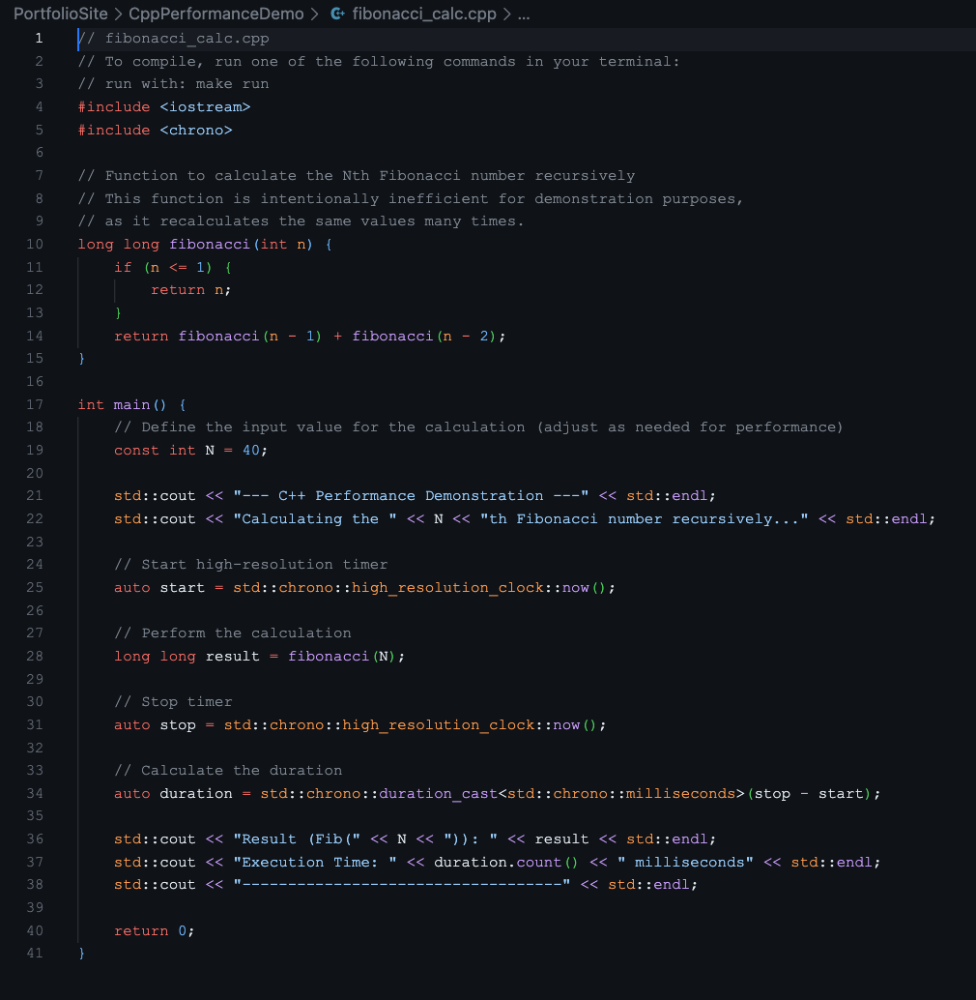
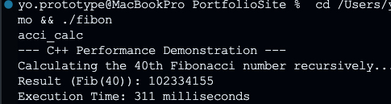

# C++ Performance Benchmark

Recursive Fibonacci calculation (N=40) showing the performance difference between compiled C++ and interpreted JavaScript. Same algorithm, ~100x speed difference.

## Screenshots

### C++ Source Code


Recursive Fibonacci with timing—intentionally inefficient to amplify the performance gap.

### Execution Output


Fibonacci(40) completes in ~311 milliseconds on this machine.

## 🛠️ Tech Stack

- C++ with chrono library for timing
- Native g++ compilation

## 🎯 Purpose

Comparison baseline for the [Node.js Async Demo](../NodeJsFlexibilityDemo). Same recursive algorithm—C++ runs ~100x faster than Node.js.

## ⚡ Results

**C++ (compiled):** ~311ms  
**Node.js (interpreted):** ~30,000ms+

Compiled code runs directly on the CPU. Interpreted code has overhead from the runtime, type checking, and garbage collection.

## 🔧 Context

### Why Recursive Fibonacci

Deliberately inefficient algorithm (exponential complexity) makes the performance difference obvious. An optimized version would be faster but wouldn't show the compiled vs interpreted gap as clearly.

### Real-World Relevance

Robotics control loops run every 20-50ms. Processing sensor data, calculating PID outputs, and commanding motors within that window requires C++ performance. This benchmark shows why the [C++ Robotics Core](../CppRoboticsCore) uses compiled C++ for real-time control—interpreted languages can't meet the timing requirements.

### Compilation

```bash
g++ -O2 -o fibonacci_calc fibonacci_calc.cpp
./fibonacci_calc
```

## 🔗 Related Projects

- [C++ Robotics Core](../CppRoboticsCore) - Real-time control systems requiring C++ performance
- [Node.js Async Demo](../NodeJsFlexibilityDemo) - When JavaScript's async flexibility matters more than raw speed

## 💡 Trade-offs

**Use C++ when:**

- Real-time requirements (robotics, game engines, signal processing)
- CPU-intensive calculations
- Embedded systems with limited resources

**Use Node.js/JavaScript when:**

- I/O-bound operations (APIs, web servers, databases)
- Rapid prototyping
- Concurrent async operations (Node.js handles this better than C++)

## 👤 Author

**Antonio Montalvo**

- GitHub: [@AntonioMontalvo](https://github.com/AntonioMontalvo)
- Portfolio: [antonio-portfolio-master.vercel.app](https://antonio-portfolio-master.vercel.app/)

## 📄 License

MIT License
