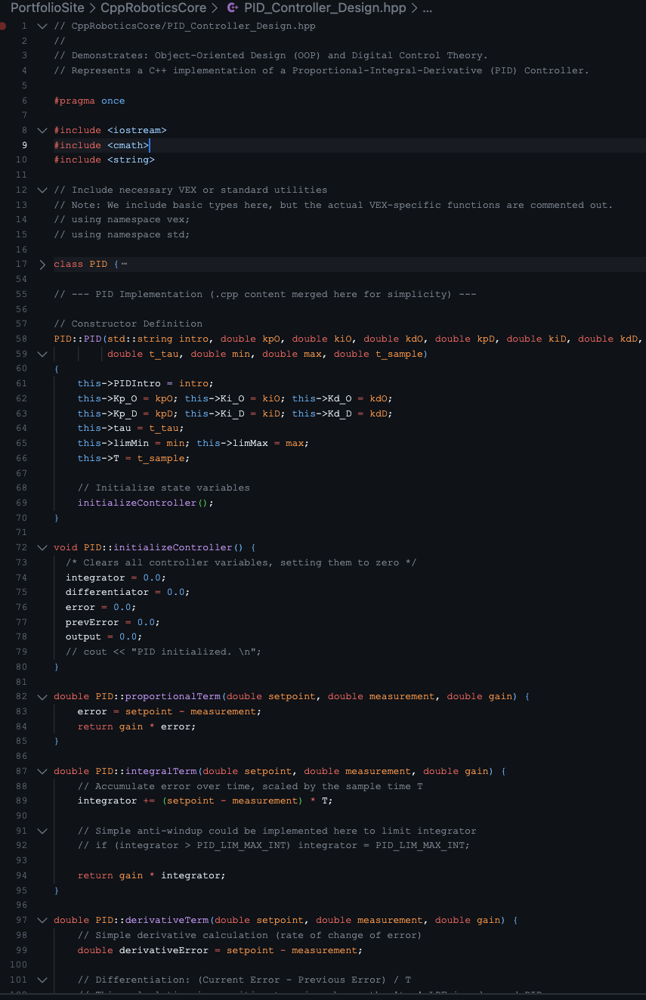
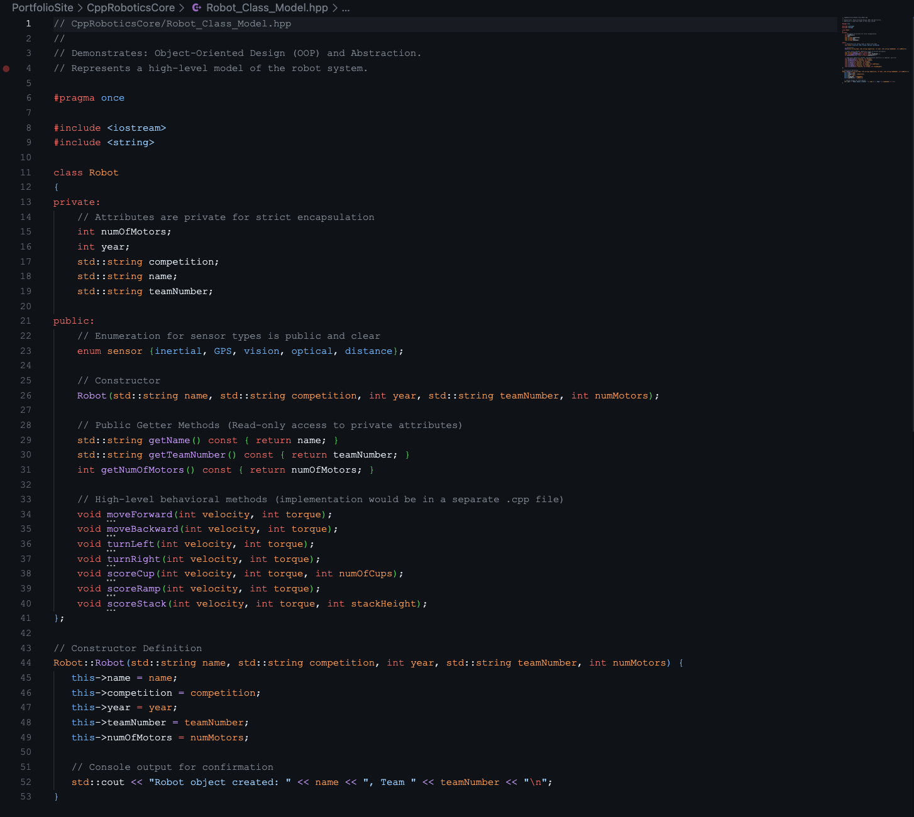
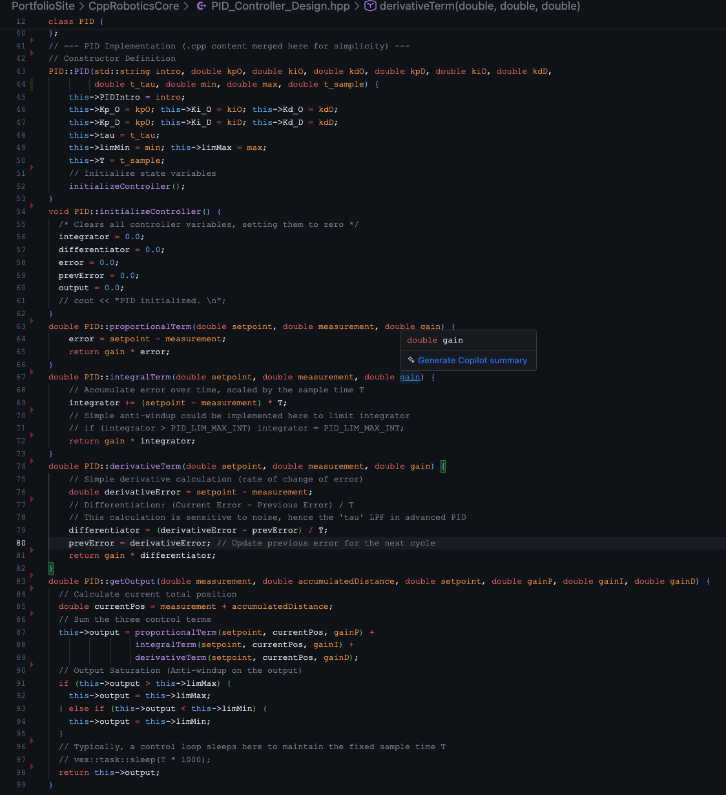

# C++ Robotics Core

Custom PID controller implementation and robot class models from VEX Robotics work. Demonstrates C++ architecture—encapsulation, control theory, and efficiency-focused design patterns.

## Screenshots

### PID Controller Class Definition

Proportional-Integral-Derivative (PID) controller class with separate gains for orientation and distance control.

### Robot Class Model

Object-oriented robot abstraction with encapsulated attributes and behavioral methods.

### PID Implementation Details

Implementation of proportional, integral, and derivative terms with low-pass filtering and anti-windup.

## 🛠️ Tech Stack

- **C++** with object-oriented design
- **Control Theory** - PID feedback control
- **VEX Robotics Framework** - Competition robotics platform

## 🎯 Key Concepts

### PID Controller

- **Proportional:** Responds to current error
- **Integral:** Eliminates steady-state error
- **Derivative:** Reduces overshoot and oscillation
- **Low-pass filter:** Reduces derivative noise (tau parameter)
- **Anti-windup:** Prevents integral accumulation during saturation

### Object-Oriented Design

- **Encapsulation:** Private attributes with public getters
- **Separation of concerns:** Orientation vs distance control
- **State management:** Persistent integrator and differentiator values
- **Configurable limits:** Saturation bounds and sample time

## 🔧 Technical Details

### PID Controller Features

- Separate tuning for orientation (heading) and distance (position)
- Configurable sample time (T) for discrete control
- Derivative low-pass filtering to reduce sensor noise
- Output saturation with min/max limits
- Anti-windup to prevent integral wind-up

### Robot Class Features

- High-level behavioral methods (moveForward, turnLeft, scoreCup)
- Encapsulated motor count and team metadata
- Sensor type enumeration for extensibility
- Clean separation between interface and implementation

## 📚 Context

Built during VEX Robotics mentoring work. These implementations demonstrate translating control theory into production C++ code for autonomous robot navigation. The PID controller handles precise positioning and heading control, while the Robot class provides a clean abstraction over low-level motor commands.

## 💡 Design Decisions

### Why C++ for Robotics

- **Performance:** Real-time control loops require minimal latency. For a concrete comparison, see the [C++ Performance Demo](../CppPerformanceDemo) showing C++ executing recursive calculations ~100x faster than Node.js.
- **Memory control:** Direct management of sensor buffers and motor commands
- **VEX platform:** Native support for C++ in competition environment

### Why Separate Orientation/Distance Controllers

Robot navigation requires independent tuning—turning in place needs different gains than driving straight. Combining both in one class with separate parameter sets keeps the code organized while allowing independent tuning.

### Why Header-Only Implementation

VEX robotics projects often use header-only libraries for easier integration. Single-file includes simplify competition code where build systems are minimal.

## 👤 Author

**Antonio Montalvo**

- GitHub: [@AntonioMontalvo](https://github.com/AntonioMontalvo)
- Portfolio: [antonio-portfolio-master.vercel.app](https://antonio-portfolio-master.vercel.app/)

## 📄 License

MIT License
