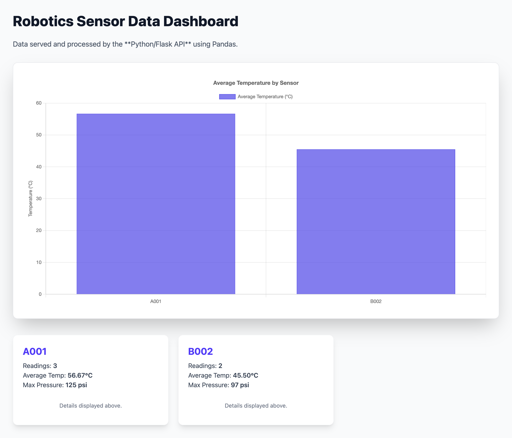

# Robotics Data Visualization Dashboard

Python Flask backend processes sensor data with Pandas, serves it to a React frontend for visualization. Demonstrates full-stack Python development with data handling and REST API design.

## 🚀 Live Demo

**[View Live Application](https://antonio-dataviz-app.vercel.app)**

## Screenshot

### Dashboard - Sensor Data Visualization

Interactive charts displaying robotics sensor readings with time-series analysis.

## 🛠️ Tech Stack

**Backend:**
- Python with Flask
- Pandas for data processing
- CORS for cross-origin requests
- RESTful API design

**Frontend:**
- React with TypeScript
- Chart.js for data visualization
- Responsive design with CSS

**Deployment:**
- Frontend: Vercel
- Backend: Vercel serverless Python functions

## 🎯 Key Features

- **Sensor Data Processing:** Python backend processes complex sensor readings
- **Data Transformation:** Pandas handles aggregation and time-series calculations
- **REST API:** Flask endpoints serve processed data to frontend
- **Interactive Charts:** Chart.js visualizations with tooltips and legends
- **Real-time Updates:** Dashboard refreshes with latest sensor data

## 🔧 Technical Decisions

### Python Flask vs Node.js
Chose Python for backend because Pandas excels at data manipulation. Processing sensor arrays, calculating moving averages, and aggregating time-series data is cleaner in Python than JavaScript.

### Chart.js vs Recharts
Used Chart.js for simpler integration with vanilla React. Recharts is more React-native but Chart.js provides more control over canvas rendering for performance with large datasets.

### Pandas vs Raw Python
Pandas handles the data transformations (filtering, grouping, resampling) that would require verbose loops in raw Python. One-liners like `df.groupby('sensor_id').mean()` replace dozens of lines of manual aggregation.

## 📦 Getting Started

### Prerequisites
- Python 3.9+
- Node.js 18+

### Installation

**Backend:**
```bash
cd server
pip install -r requirements.txt
python app.py
```

**Frontend:**
```bash
cd client
npm install
# Create .env with:
# VITE_API_URL=http://localhost:5000
npm run dev
```

## 🔒 Environment Variables

**Frontend (.env):**
```
VITE_API_URL=http://localhost:5000
```

## 🚀 Deployment

- Frontend deployed to Vercel (static build)
- Backend deployed as Vercel serverless Python function
- CORS configured for cross-origin requests

## 👤 Author

**Antonio Montalvo**
- GitHub: [@AntonioMontalvo](https://github.com/AntonioMontalvo)
- Portfolio: [antonio-portfolio-master-bt2g.vercel.app](https://antonio-portfolio-master-bt2g.vercel.app/)

## 📄 License

MIT License
