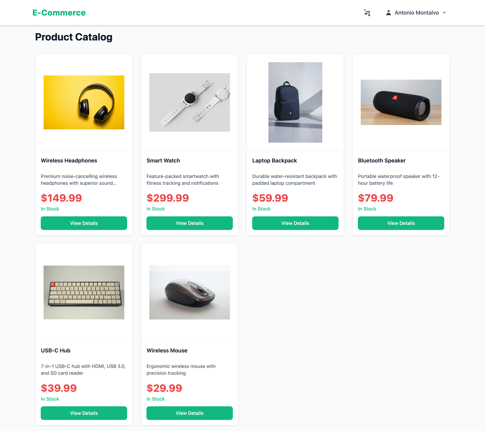
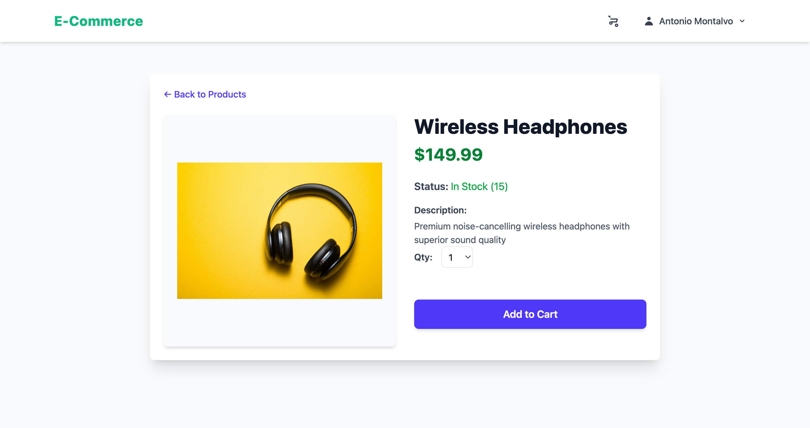
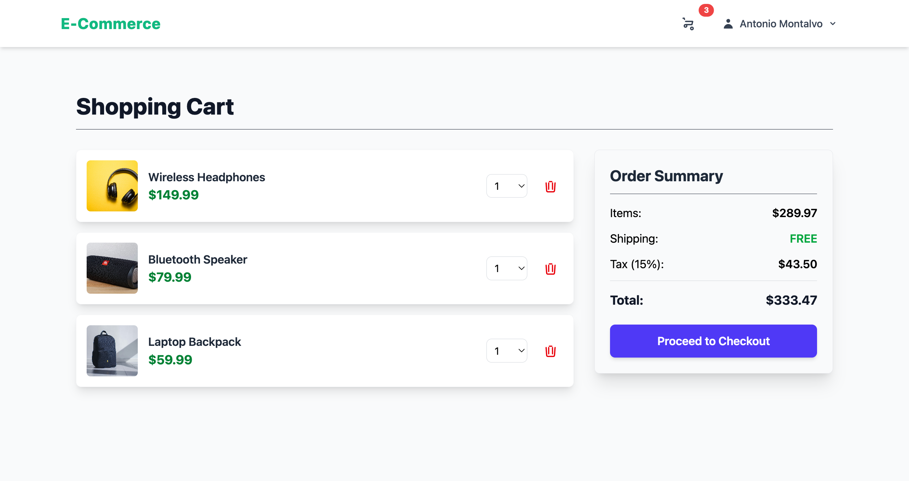
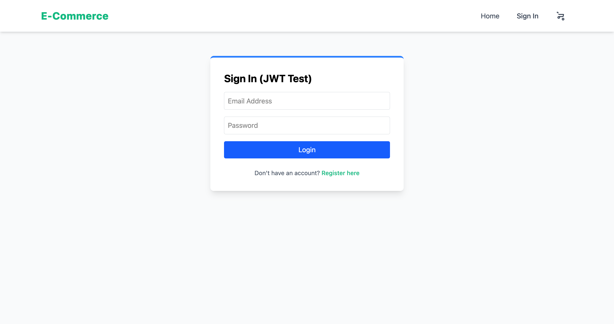
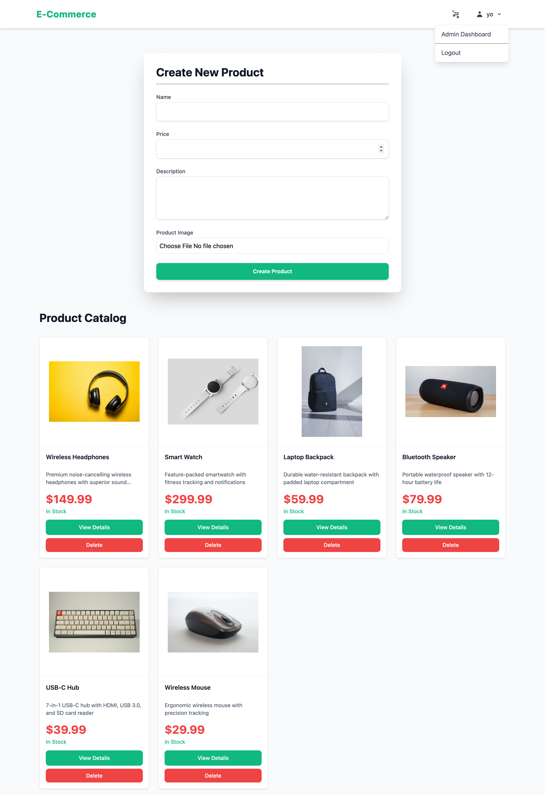
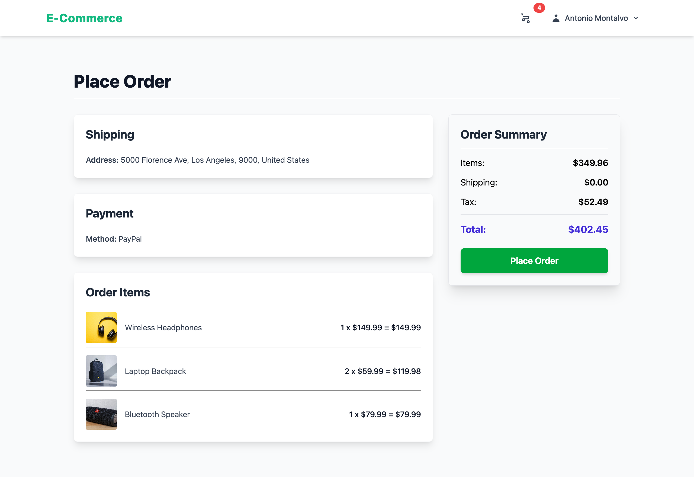

# E-Commerce MERN Stack Application

A full-stack e-commerce platform with secure JWT authentication, admin controls, and MongoDB. Built to demonstrate NoSQL database design, JWT authentication patterns, and complex business logic.

## 🚀 Live Demo

**[View Live Application](https://antonio-ecommerce-app.vercel.app)**

## Screenshots

### Homepage - Product Grid


Browse products with search and category filtering.

### Product Detail


Detailed product information with Add to Cart functionality.

### Shopping Cart


Manage cart items with quantity controls and real-time total calculation.

### Authentication


Secure JWT-based authentication with login and registration.

### Admin Dashboard


Admin panel for product management, inventory tracking, and order processing.

### Checkout Flow


Multi-step checkout with order summary and payment processing.

## 🛠️ Tech Stack

**Frontend:**

- React 19 with TypeScript
- Tailwind CSS for responsive design
- Zustand for state management
- Vite for build tooling

**Backend:**

- Node.js with Express
- MongoDB for flexible product schemas
- JWT authentication with bcrypt password hashing
- RESTful API design

**Deployment:**

- Frontend: Vercel
- Backend: Vercel serverless functions
- Database: MongoDB Atlas

## 🎯 Key Features

- **User Authentication:** Secure JWT-based auth with password hashing
- **Product Management:** Full CRUD operations for products (admin only)
- **Shopping Cart:** Persistent cart with quantity controls
- **Order Processing:** Multi-step checkout with order history
- **Admin Dashboard:** Role-based access control (RBAC) for admin users
- **Search & Filter:** Product search and category filtering
- **Responsive Design:** Mobile-first design with Tailwind CSS

## 🔧 Technical Decisions

### MongoDB vs PostgreSQL

Chose MongoDB for flexible product schemas—adding new product attributes (color options, size charts) doesn't require schema migrations. Product documents can vary in structure while maintaining type safety on the frontend with TypeScript.

### JWT vs OAuth

Implemented traditional JWT authentication to contrast with the OAuth approach in kanban-next. Shows understanding of both patterns—JWT for simple auth, OAuth for third-party identity providers.

### Zustand vs Redux

Zustand provides simpler state management without boilerplate. For this app's complexity level (cart, auth, products), Zustand's lightweight API works better than Redux's verbose setup.

## 📦 Getting Started

### Prerequisites

- Node.js 18+
- MongoDB (local or Atlas)

### Installation

**Backend:**

```bash
cd server
npm install
# Create .env with:
# MONGODB_URI=your_mongodb_connection_string
# JWT_SECRET=your_jwt_secret
npm run dev
```

**Frontend:**

```bash
cd client
npm install
# Create .env with:
# VITE_API_URL=http://localhost:5000
npm run dev
```

## 🔒 Environment Variables

**Backend (.env):**

```
MONGODB_URI=mongodb+srv://...
JWT_SECRET=your_secret_key
PORT=5000
```

**Frontend (.env):**

```
VITE_API_URL=http://localhost:5000
```

## 🚀 Deployment

Both frontend and backend deployed to Vercel:

- Frontend uses Vite build output
- Backend uses Vercel serverless functions
- MongoDB hosted on Atlas

##  Author

**Antonio Montalvo**

- GitHub: [@AntonioMontalvo](https://github.com/AntonioMontalvo)
- Portfolio: [antonio-portfolio-master-bt2g.vercel.app](https://antonio-portfolio-master-bt2g.vercel.app/)

## 📄 License

MIT License
