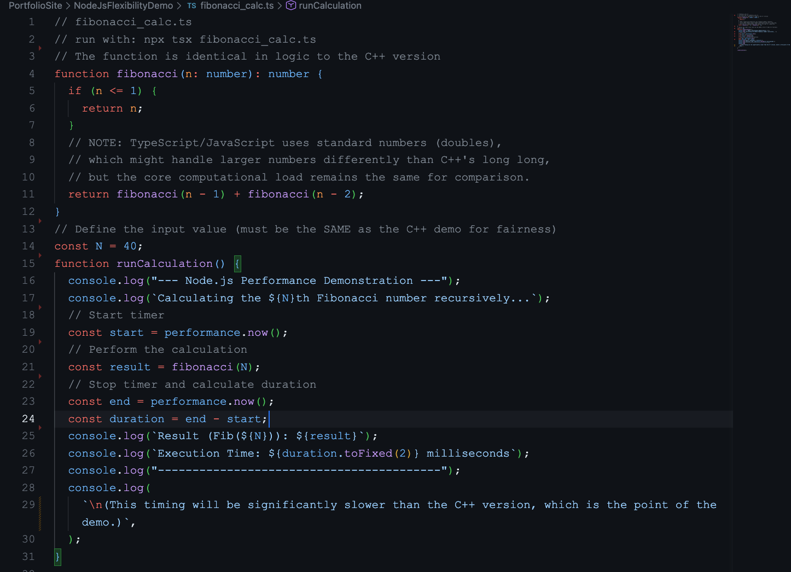
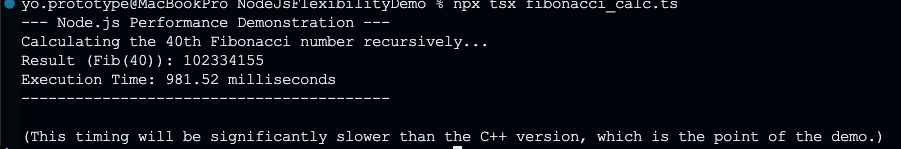

# Node.js Async Flexibility Demo

Same recursive Fibonacci as the [C++ Performance Demo](../CppPerformanceDemo), but this one shows the trade-off. Node.js runs ~100x slower for CPU-intensive calculations—but that's not what Node.js is built for.

## Screenshots

### TypeScript Source Code


Identical algorithm to the C++ version—same recursive logic, different language.

### Execution Output


Node.js takes significantly longer for this CPU-bound task (~30,000ms vs C++'s ~311ms).

## 🛠️ Tech Stack

- Node.js with TypeScript
- tsx for running TypeScript directly
- performance API for timing

## 🎯 The Point

This isn't about bashing JavaScript. It's about understanding trade-offs. Node.js loses on raw CPU performance—but wins on other fronts:

**Where Node.js excels:**

- I/O operations (database queries, API calls, file operations)
- Concurrent async tasks without threading complexity
- Rapid prototyping and iteration
- Web servers handling thousands of concurrent connections

**Where C++ excels:**

- CPU-intensive calculations
- Real-time systems with strict timing requirements
- Embedded systems with limited resources

## 💡 Real-World Example

The [E-commerce MERN app](../../EcommerceApp) uses Node.js on the backend. Why? Because it spends most of its time waiting—waiting for database queries, waiting for API responses, waiting for file uploads. Node.js handles this asynchronous I/O better than C++ would.

The [C++ Robotics Core](../CppRoboticsCore) uses compiled C++. Why? Because it needs to process sensor data, calculate PID outputs, and command motors every 20-50ms. That 100x performance difference matters when you're in a real-time control loop.

## 🔧 Running the Demo

```bash
cd NodeJsFlexibilityDemo
npx tsx fibonacci_calc.ts
```

## 🔗 Related Projects

- [C++ Performance Demo](../CppPerformanceDemo) - Direct comparison showing C++'s speed advantage
- [C++ Robotics Core](../CppRoboticsCore) - Why real-time systems need compiled languages
- [E-commerce MERN](../../EcommerceApp) - Where Node.js async capabilities shine

## 👤 Author

**Antonio Montalvo**

- GitHub: [@AntonioMontalvo](https://github.com/AntonioMontalvo)
- Portfolio: [antonio-portfolio-master.vercel.app](https://antonio-portfolio-master.vercel.app/)

## 📄 License

MIT License
