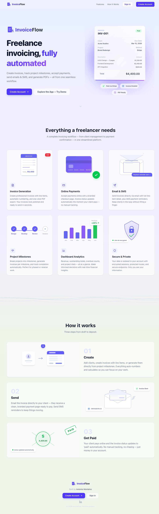
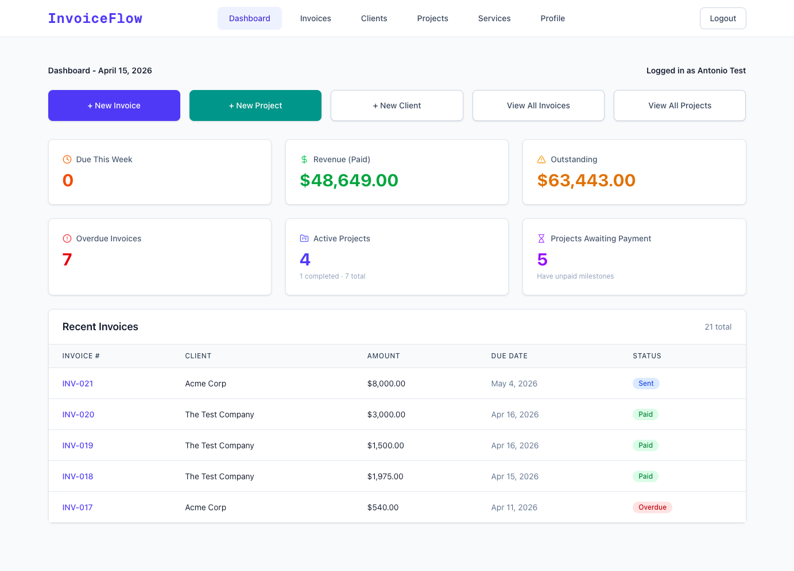
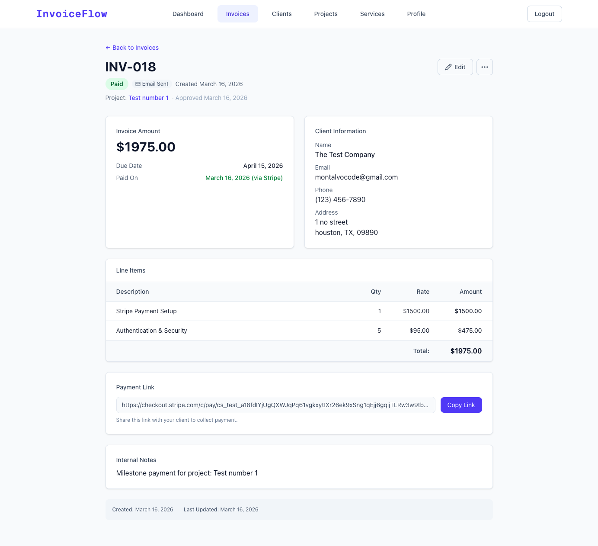
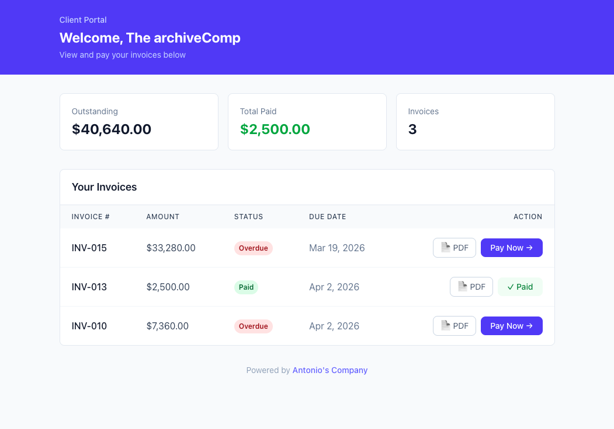
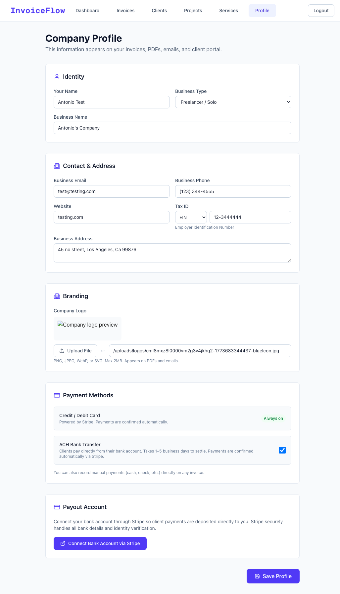

# Antonio Montalvo — Portfolio

Eight production projects spanning React, Next.js, Node.js, Python, and C++. This README serves as both the portfolio site documentation and the architecture deep-dive for my flagship project, AM InvoiceFlow, which is maintained in a private repository.

**[View Live Portfolio](https://antonio-portfolio-master.vercel.app/)** · **[View InvoiceFlow Live](https://my-invoice-flow.vercel.app/)**

---

## ⭐ Flagship Project — AM InvoiceFlow

A freelance invoicing SaaS built from scratch. Create invoices, track project milestones, accept online payments, send emails and SMS, generate PDFs, and give clients their own portal — all from one workflow.

162 tests · 92% line coverage · 80+ hours of development

### Screenshots

**Landing Page**



**Dashboard**



**Invoice Detail**



**Client Portal**



**Settings / Company Profile**



### Features

| Category                  | What it does                                                                                                                                                                                                                                        |
| ------------------------- | --------------------------------------------------------------------------------------------------------------------------------------------------------------------------------------------------------------------------------------------------- |
| **Invoicing**             | Create, edit, archive invoices with itemized line items. Auto-numbering (INV-001, INV-002). Cent-based storage to avoid floating-point errors. Status workflow: Draft → Pending → Paid / Overdue / Cancelled. Branded PDF generation via React-PDF. |
| **Payments**              | Stripe Checkout with card + ACH bank transfer. Webhook-driven status updates — no polling. Automatic receipt emails with full line-item breakdown. Payment method tracking (card vs bank).                                                          |
| **Client Management**     | Client directory with soft-delete archival. Public token-based portal where clients view invoices and pay directly — no login required. One-click portal link from the clients list.                                                                |
| **Communication**         | SendGrid HTML emails with line items and payment links. Twilio SMS reminders with direct payment links. Webhook-based delivery tracking (delivered, bounced, dropped). Secure password reset with anti-enumeration protection.                      |
| **Projects & Milestones** | Organize work into projects. Break projects into milestone phases with their own line items. One-click milestone-to-invoice generation. Service rates snapshotted at creation time.                                                                 |
| **Dashboard**             | Total revenue, outstanding, overdue, and upcoming counts. Recent invoices table. Active/completed/awaiting-payment project stats.                                                                                                                   |
| **Settings**              | Company profile (name, email, phone, address, tax ID, logo upload). Reusable service catalog with default rates. Freelancer vs company mode.                                                                                                        |
| **Security**              | Email/password auth with bcrypt via NextAuth.js. Demo mode enforced server-side and client-side. Admin upgrade endpoint that hard-deletes demo data before flipping to pro.                                                                         |

### Tech Stack

**Frontend:** Next.js 16 (App Router), TypeScript 5, Tailwind CSS 4, Framer Motion, React-PDF, Radix UI

**Backend:** PostgreSQL via Neon (serverless), Prisma 7, NextAuth.js v4, Stripe Connect, SendGrid, Twilio, Zod 4

**Testing:** Vitest 4 + React Testing Library — 162 tests across 11 files, 92% line coverage

**Deployment:** Vercel (serverless functions, automatic previews, Vercel Blob for file uploads)

### Architecture Decisions

**Webhook-driven payments.** Instead of polling Stripe or relying on client-side callbacks, the app uses server-side webhooks. When Stripe fires `checkout.session.completed`, the webhook handler updates the invoice and triggers a receipt email. ACH payments are marked "processing" until the bank confirms — showing "paid" before the money arrives would be misleading.

**Demo mode at two levels.** Server-side: `isDemoUser(session)` blocks real emails, payments, and PDF generation. Client-side: `useIsDemo()` renders a persistent banner explaining restrictions. This lets potential clients explore the full UI without triggering real integrations.

**Multi-tenant isolation.** Every query filters by `userId`. Cascade deletes ensure deleting a user removes all their data. The admin upgrade endpoint uses this same cascade to hard-delete demo data before flipping a user to pro.

**Milestone-to-invoice generation.** Each project milestone has its own line items sourced from the service catalog. Clicking "Generate Invoice" copies the line items into a real invoice, links it to the project, and marks the milestone as invoiced. Catalog price changes don't retroactively affect existing milestones.

**Landing page performance.** The animated landing page — 3D invoice mockup, glowing orb, particle network, wave dividers — uses canvas and CSS animations so they don't block React renders. The wave filaments are pure CSS with no JavaScript.

### Test Coverage

| File                | Statements | Lines |
| ------------------- | ---------- | ----- |
| not-found.tsx       | 100%       | 100%  |
| dashboard/page.tsx  | 100%       | 100%  |
| dashboard/error.tsx | 100%       | 100%  |
| register/page.tsx   | 100%       | 100%  |
| Header.tsx          | 100%       | 100%  |
| settings/profile    | 91%        | 95%   |
| projects/page.tsx   | 94%        | 94%   |
| invoices/page.tsx   | 92%        | 91%   |
| login/page.tsx      | 95%        | 95%   |
| page.tsx (Landing)  | 91%        | 91%   |
| clients/page.tsx    | 78%        | 77%   |

---

## All Projects

| #   | Project                                                 | Stack                                                      | Links                                                                                                                                              |
| --- | ------------------------------------------------------- | ---------------------------------------------------------- | -------------------------------------------------------------------------------------------------------------------------------------------------- |
| 8   | **AM InvoiceFlow** — Freelance Invoicing SaaS           | Next.js 16, Prisma 7, PostgreSQL, Stripe, SendGrid, Twilio | [Live Demo](https://my-invoice-flow.vercel.app/) · [Deep-Dive ↑](#-flagship-project--am-invoiceflow)                                               |
| 6   | **Kanban Board** (Next.js) — Full-stack task management | Next.js 16, PostgreSQL, NextAuth, Zustand, @dnd-kit        | [Live Demo](https://kanban-next-flame.vercel.app/) · [Code](https://github.com/AntonioMontalvo/kanban-next)                                        |
| 2   | **E-Commerce** (MERN) — Full-stack shopping platform    | React, Node.js, Express, MongoDB, JWT, Stripe              | [Live Demo](https://antonio-ecommerce-app.vercel.app) · [Code](https://github.com/AntonioMontalvo/Antonio-Portfolio-Master/tree/main/EcommerceApp) |
| 3   | **Data Visualization Dashboard** — Sensor analytics     | Python, Flask, Pandas, React, Chart.js                     | [Live Demo](https://antonio-dataviz-app.vercel.app) · [Code](https://github.com/AntonioMontalvo/Antonio-Portfolio-Master/tree/main/DataVizApp)     |
| 1   | **Portfolio Site** — This site                          | React, React Router, Tailwind CSS, TypeScript              | [Live](https://antonio-portfolio-master.vercel.app/) · [Code](https://github.com/AntonioMontalvo/Antonio-Portfolio-Master/tree/main/portfoliosite) |
| 7   | **C++ Robotics Core** — PID controller & robot models   | C++, OOP, Control Theory                                   | [Code](https://github.com/AntonioMontalvo/Antonio-Portfolio-Master/tree/main/CppRoboticsCore)                                                      |
| 4   | **C++ Performance Benchmark** — Fibonacci benchmark     | C++, Standard Library                                      | [Code](https://github.com/AntonioMontalvo/Antonio-Portfolio-Master/tree/main/CppPerformanceDemo)                                                   |
| 5   | **Node.js Async Demo** — Concurrent API fetching        | Node.js, TypeScript, REST API                              | [Code](https://github.com/AntonioMontalvo/Antonio-Portfolio-Master/tree/main/NodeJsFlexibilityDemo)                                                |

---

## Portfolio Site Tech Stack

**Vite + React 19 + TypeScript + Tailwind CSS 4**, deployed on Vercel.

Vite for instant dev server startup. React 19 for modern hooks. TypeScript for compile-time type safety. Tailwind for responsive design without custom media queries. Every push to `main` triggers automatic deployment.

### Getting Started

```bash
git clone https://github.com/AntonioMontalvo/PortfolioSite.git
cd PortfolioSite/portfoliosite
npm install
npm run dev
```

Open [http://localhost:5173](http://localhost:5173).

### Project Structure

```
portfoliosite/
├── src/
│   ├── components/        # ProjectCard, Header
│   ├── data/              # projectsData.ts
│   ├── pages/             # HomePage, ProjectsPage, AboutPage
│   ├── types.ts           # IProject interface
│   ├── App.tsx
│   └── main.tsx
├── public/                # Static assets & screenshots
└── index.html
```

## Author

**Antonio Montalvo**

- Portfolio: [antonio-portfolio-master.vercel.app](https://antonio-portfolio-master.vercel.app/)
- GitHub: [@AntonioMontalvo](https://github.com/AntonioMontalvo)
- LinkedIn: [linkedin.com/in/antonio-montalvo](https://linkedin.com/in/antonio-montalvo)

## License

This project is open source and available under the MIT License.
